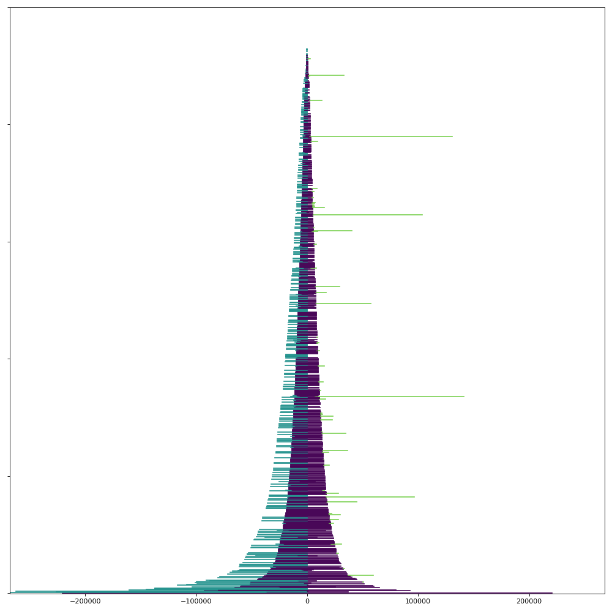

# compare busco sets

Compare locations of predictions between two BUSCO sets to check the extent of overlap between predicted BUSCO loci at different levels.

Example data called with:

```
./scripts/busco-set-overlap/compare-busco-sets.py scripts/busco-set-overlap/GCA_922989275.2.metazoa_odb10_full_table.tsv scripts/busco-set-overlap/GCA_922989275.2.mollusca_odb10_full_table.tsv scripts/busco-set-overlap/output.tsv
```

Produces this plot:



_**Overlap between metazoa_odb10 and mollusca_odb10 BUSCO loci for the Gari tellinella assembly GCA_922989275.2**_

The purple portion of each line is the length of the overlapping prediction (a metazoa BUSCO gene and a mollusca BUSCO gene were both found at the same coordinates on the assembly). Lines off to the left are regions only predicted with the metazoa set (where these lines reach the centre, there was no corresponding match with the mollusca set). Lines off to the right are regions only predicted with the mollusca set (mollusca only lines not included as there would be ~4000 of them).
